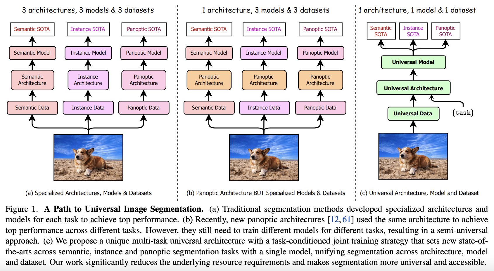
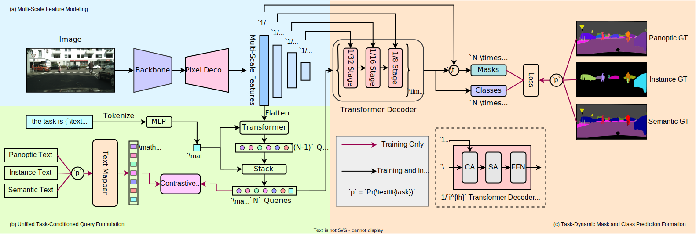
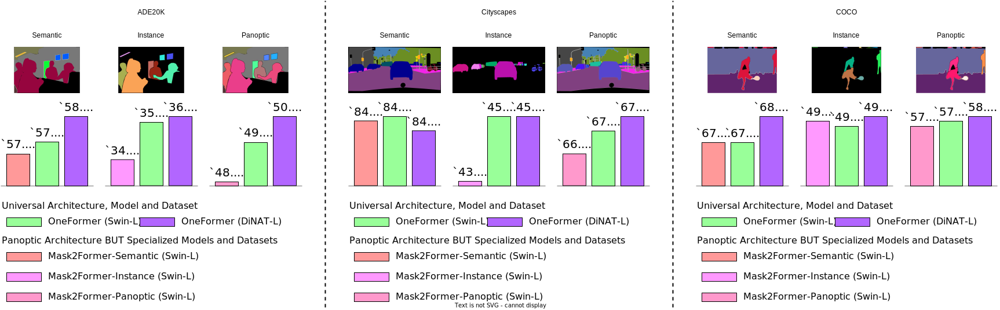

# OneFormer: One Transformer to Rule Universal Image Segmentation

#### Features

- OneFormer is the **first** multi-task universal image segmentation framework based on transformers.
- OneFormer needs to be trained only once with a single universal architecture, a single model, and on a single dataset , to outperform existing frameworks across semantic, instance, and panoptic segmentation tasks.
- OneFormer uses a task-conditioned joint training strategy, uniformly sampling different ground truth domains (semantic instance, or panoptic) by deriving all labels from panoptic annotations to train its multi-task model.
- OneFormer uses a task token to condition the model on the task in focus, making our architecture task-guided for training, and task-dynamic for inference, all with a single model.

## Results

- &dagger; denotes the backbones were pretrained on ImageNet-22k.

### ADE20K

| Method | Backbone | Crop Size |  PQ   | AP   | mIoU   (s.s) | mIoU   (ms+flip) | #params |
|   :---:| :---:    |  :---:    | :---: | :---:| :---:           | :---:               | :---:   |
| OneFormer | Swin-L&dagger; | 1280&times;1280 | 51.4 | 37.8 | 57.0 | 57.7 | 219M | 
| OneFormer | DiNAT-L&dagger; | 1280&times;1280 | 51.5 | 37.1 | 58.3 | 58.7 | 223M | 

### Cityscapes

| Method | Backbone |  PQ   | AP   | mIoU   (s.s) | mIoU   (ms+flip) | #params |
|   :---:| :---:    | :---: | :---:| :---:      | :---:          | :---:   |
| OneFormer | Swin-L&dagger; | 67.2 | 45.6 | 83.0 | 84.4 | 219M | 
| OneFormer | DiNAT-L&dagger; | 67.6 | 45.6 | 83.1 | 84.0 | 223M | 

### COCO

| Method | Backbone |  PQ   |  PQTh   |  PQSt   | AP | mIoU | #params |
|   :---:| :---:    | :---: | :---:              | :---:              |:---:| :---:| :---:  |
| OneFormer | Swin-L&dagger; | 57.9 | 64.4 | 48.0 | 49.0 | 67.4 | 219M | 
| OneFormer | DiNAT-L&dagger; | 58.0 | 64.3 | 48.4 | 49.2 | 68.1 | 223M | 

## References

[OneFormer](https://praeclarumjj3.github.io/oneformer/)
